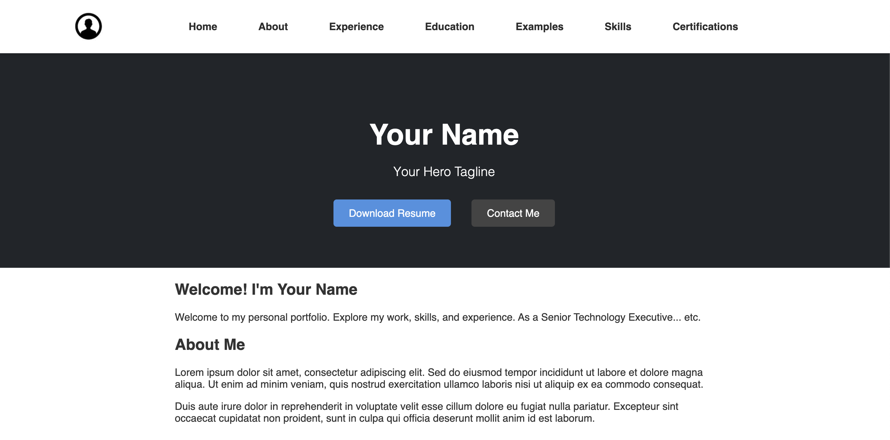

# Vibe-Coded Single-Page Resume Template

[](https://opensource.org/licenses/MIT)
[](https://deepmind.google/technologies/gemini/)
[](https://www.anthropic.com/claude)
[](https://cursor.sh)

## 🌐 [Live Demo](https://eleventy-resume-builder.pages.dev/)

A vibe-coded, clean, and responsive single-page resume website built with Eleventy. Features data-driven content, modular components, and easy customization through JavaScript data files. Part of my collection of pure vibe-coded projects.



## What is Vibe-Coding?
This project follows the vibe-coding philosophy - where code isn't just functional, it's a reflection of personal style and intuition. Every component and design choice was made based on vibes, creating a resume template that feels authentically personal.

### Development Approach
This project was developed using a vibe-coding workflow powered by AI:
- **Primary Development:** Gemini 2.5 Pro 
- **Quality Assurance & Debugging:** Claude 3.5 Sonnet
- **Development Environment:** Cursor IDE for seamless AI integration

## Tech Stack
- **Static Site Generator:** Eleventy (chosen for its immaculate vibes)
- **Templating:** Nunjucks
- **Styling:** Vanilla CSS (keeping it pure and vibey)
- **Content:** Markdown + JavaScript data files

### Why JavaScript Data Files?
The choice to use JavaScript (`.js`) files for data management instead of JSON offers several powerful advantages:
- **Dynamic Data Generation:** Data can be computed on-the-fly, allowing for dynamic content generation
- **Module System:** Leverage Node.js's module system to organize and import data across files
- **Function Integration:** Include functions for data transformation and formatting
- **Development Flexibility:** Write complex data transformations and utilize JavaScript's full feature set
- **Environment Variables:** Easily integrate environment variables and external configurations
This approach aligns perfectly with the vibe-coding philosophy - providing maximum flexibility while maintaining clean, maintainable data structures.

## Prerequisites

*   [Node.js](https://nodejs.org/) (which includes npm)

## Getting Started

1.  **Clone the repository:**
    ```bash
    git clone https://github.com/KaramelBytes/eleventy-resume-builder.git
    cd eleventy-resume-builder
    ```

2.  **Install dependencies:**
    ```bash
    npm install
    ```

3.  **Build the site:**
    This command compiles the site into the `_site` directory.
    ```bash
    npm run build
    ```
    (This script runs `npx eleventy`)

4.  **Serve the site locally (for development):**
    This command builds the site, starts a local web server, and watches for changes.
    ```bash
    npx eleventy --serve
    ```
    You can then view the site at `http://localhost:8080` (or the port specified in the console output).

## Why This Project?

This project was created to demonstrate a modern, maintainable approach to building static resumes. The technical decisions were driven by:
- **Eleventy**: Chosen for its speed, simplicity, and flexibility in static site generation
- **Data-Driven Architecture**: All content is managed through JavaScript data files, making updates a breeze
- **Component-Based Structure**: Modular design allows for easy maintenance and customization

## Deployment

This site can be easily deployed to various platforms:

### GitHub Pages
1. Enable GitHub Pages in your repository settings
2. Set the build directory to `_site`
3. Your site will be live at `https://[username].github.io/[repo-name]`

### Netlify
1. Connect your repository to Netlify
2. Set build command to `npm run build`
3. Set publish directory to `_site`

### Vercel
1. Import your repository to Vercel
2. Build command: `npm run build`
3. Output directory: `_site`

## Purpose

This repository houses a straightforward template for quickly deploying a personal resume site. It's primarily for individual use and public display rather than community contributions. The goal was to create a clean, data-driven resume that's easy to maintain.

## Key Features

*   **Static Site Generation:** Powered by Eleventy for speed and simplicity.
*   **Prominent Hero Section:** Features a full-width hero area on the homepage for name, tagline, and call-to-action buttons (e.g., resume download, contact).
*   **Data-Driven Content:** Resume sections (hero, welcome, experience, education, skills, etc.) are populated from JavaScript data files located in `src/_data/`. This makes content updates easy without needing to touch HTML structure directly.
*   **Modular Template Structure:** 
    - **Components:** Reusable UI components in `src/_includes/components/`
    - **Partials:** Smaller template fragments in `src/_includes/partials/`
    - **Layouts:** Base page structures in `src/_includes/` (shared directory with components and partials)
*   **Markdown Support:** Content within data files can use Markdown, which is then rendered to HTML using markdown-it with anchor support.
*   **Basic Styling:** Comes with a clean, responsive CSS stylesheet.

## Project Structure

```
src/
├── _data/          # JavaScript data files for content
├── _includes/      # Template files
│   ├── components/ # Reusable UI components
│   ├── partials/   # Smaller template fragments
│   └── *.njk       # Layout templates
├── assets/         # Static assets (CSS, images, etc.)
└── index.md        # Main entry point
```

## Customization

1.  **Content:** Edit the JavaScript files in `src/_data/` to update your resume information. The files are pre-filled with placeholder data to guide you.
    *   **Personal & Hero Information (`src/_data/personal.js`):** Update your name, contact details, hero section title (`hero_name`), tagline (`hero_tagline`), and path to your resume PDF (`resume_path`). Ensure your resume PDF (e.g., `your-name-resume.pdf`) is placed in a suitable location like `src/assets/documents/` and the `resume_path` reflects this (e.g., `/assets/documents/your-name-resume.pdf`). The hero section itself is structured in `src/_includes/components/hero.njk`.
    *   **Other Sections (Experience, Education, etc.):** For fields intended to hold multi-line content or lists (like job responsibilities, education details, or lists of technologies), use a `_markdown` suffix in the field name (e.g., `responsibilities_markdown`, `technologies_markdown`). Structure the content within these fields as a Markdown-formatted string. These are typically rendered in the templates using the `| md | safe` Nunjucks filters.
    *   **Simple Text Fields:** For simple, single-line text fields that don't require Markdown formatting, the `| safe` filter is often used in templates.
    *   Review the existing data files and component templates (`src/_includes/components/`) to see examples of these patterns.
2.  **Site Configuration:**
    *   Update your site's URL in `src/_data/site.js` (the `url` field).
    *   In `.eleventy.js`, review the `robotstxt` plugin configuration. You may need to set the `host` property to your site's full URL if you want it included in `robots.txt`.
    *   Replace placeholder images in `src/assets/images/`: specifically `profile-placeholder.jpg` (used in the header) and `og-image.jpg` (used for social media previews).
3.  **Structure/Layout:** 
    *   The main page structure is defined in `src/index.md`. It includes various content components (like `welcome.njk`, `about.njk`, etc.) by wrapping them in `<section>` tags, often with a nested `<div class="container">` for consistent width and padding.
    *   The primary layout template `src/_includes/default.njk` handles the overall HTML shell, including the site header, footer, and the conditional inclusion of the full-width hero section (`hero.njk`) on the homepage.
    *   Modify Nunjucks templates in `src/_includes/` (layouts and components) if you need to change the HTML structure further.
4.  **Styling:** Update `src/assets/css/styles.css` for visual changes.
5.  **Site Metadata:** 
    *   Adjust the main page title in `src/index.md` (front matter -> title).
    *   Update your name/contact details in `src/_data/personal.js` (which also populates the footer links for LinkedIn, email, etc.).
    *   Update the `author` field in `package.json`.
    *   Update the `[year]` and `[fullname]` placeholders in the `LICENSE` file.

## Contributions

This is primarily a personal project and is not actively seeking contributions. However, feel free to fork it and adapt it for your own purposes! 